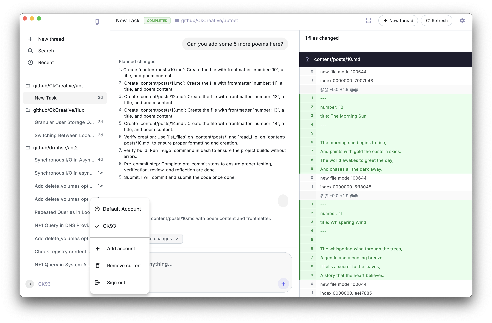
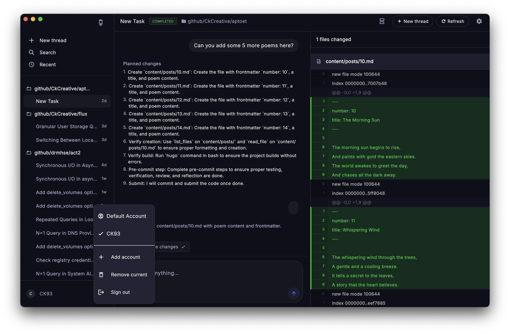

# Jules

A polished Flutter client for the Jules API, built for reviewing sessions, chatting with the agent, and inspecting generated code changes in a native app experience.

## Screenshots

<p align="center">
  <a href="./light_mode.png">
    
  </a>
  <a href="./dark_mode.png">
    
  </a>
</p>

<p align="center">
  Click either screenshot to view it full size.
</p>

## Highlights

- Multi-account API key support with fast account switching
- Session history grouped by repository with built-in search
- Chat timeline for prompts, plans, progress updates, and agent responses
- Resizable diff panel for reviewing code changes produced by Jules
- Local caching with background sync and offline-state awareness
- Light and dark themes with responsive layouts for smaller screens

## Tech Stack

- Flutter
- Provider for state management
- Hive for local persistence
- `http` for Jules API requests
- `window_manager` for a desktop-style macOS shell

## Requirements

- Flutter SDK
- Xcode for macOS and iOS builds
- Android Studio and Android SDK for Android builds
- A Jules API key with access to `https://jules.googleapis.com/v1alpha`

## Getting Started

From the repository root:

```bash
cd jules_flutter
flutter pub get
cd ..
npm run dev
```

On first launch, add:

1. An account name
2. Your Jules API key

The default development command launches the macOS app. The Flutter project also includes iOS, Android, web, Windows, and Linux targets.

## Available Commands

| Command | Description |
| --- | --- |
| `npm run dev` | Run the app on macOS |
| `npm run dev:macos` | Run the app on macOS |
| `npm run dev:ios` | Run on a connected iOS device |
| `npm run dev:simulator` | Run on the active iOS simulator |
| `npm run dev:android` | Run on Android |
| `npm run analyze` | Run `flutter analyze` |
| `npm run build:macos` | Build the macOS app |
| `npm run build:ios` | Build the iOS app |
| `npm run build:android` | Build the Android APK |

## Project Structure

- `jules_flutter/` contains the Flutter application
- `scripts/` contains helper launch scripts for platform-specific Flutter runs
- `light_mode.png` and `dark_mode.png` provide the README screenshots

## Notes

- API keys and cached session data are stored locally on the device.
- New sessions are created against repositories returned by the Jules `sources` API.
- The current flow is text-prompt based; attachments are not supported by the Jules API yet.
